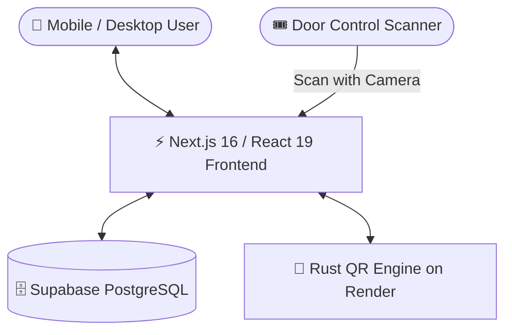

# 🎟️ EventPass — Event Check-In and QR Management System


**EventPass** is a web application for publishing events, registering participants, issuing rotating QR passes, and managing secure door check-ins from a mobile-friendly organizer workspace.

## 📌 Project Summary

- **Next.js frontend and API routes**: participant registration, organizer event management, QR display, scanner workflows, analytics, and authentication.
- **Supabase**: PostgreSQL data storage, authentication, Row Level Security, database functions, and realtime check-in updates.
- **Rust QR API on Render**: Axum and Tokio service that generates QR images and creates or validates rotating 30-second tokens.
- **Activepieces automation**: a Supabase `registrations` insert can send only the new registration ID to a GitHub workflow, which generates and stores QR data using server-side secrets.
- **Render keep-alive**: a cron service such as cron-job.org sends `GET https://YOUR-APP.onrender.com/health` every 10 minutes to reduce cold starts on the free Render web service. This is separate from registration processing.

---

## 🌟 Key Features

### 1. 🎫 Dynamic & High-Security QR Passes
- **Dynamic 30s Cryptographic Token**: Prevents ticket sharing and screenshot fraud using time-step SHA-256 token hashing.
- **Live QR Pass**: Displays the participant's current QR pass in the app with a registration number (e.g. `25MIS1157`).
- **Event Isolation**: Unique registration passes for each event — checking in to Event A will never validate at Event B.

### 2. 📷 Door-Control Scanner
- **Live Camera Scanner**: Rapid barcode scanning via device camera with instant feedback.
- **Auto-Event Detection**: Automatically detects and matches the attendee's registered event.
- **Duplicate Check-In Protection**: Instantly detects and warns if a badge has already been scanned, timestamping exact entry time.
- **Offline Sync Queue**: Automatically queues check-ins locally if internet drops and syncs when reconnected.

### 3. 👥 Participant & Organizer Workspaces
- **Participant Workspace**: Browse upcoming published events, register in one click, view live passes, and unregister if needed.
- **Organizer Dashboard**: Real-time attendee counter, check-in percentage, upcoming events summary, and live participant table.
- **Event Management**: Create new events with capacity limits, event numbers, dates, times, and types.

### 4. ⚡ Rust QR Microservice
- Powered by **Axum** and **Tokio**, hosted on **Render**, for QR rendering and rotating token generation/validation.

---

## 🏗️ System Architecture



- **Frontend**: Next.js 16 (Turbopack, React 19, Vanilla CSS Design System)
- **Database & Auth**: Supabase PostgreSQL with Row Level Security (RLS) and Realtime
- **QR Microservice**: Rust Axum API deployed on Render (`https://rust-qr-api.onrender.com`)

### Registration and QR automation

1. A participant registers through the Next.js app.
2. Supabase emits an insert webhook for `public.registrations`.
3. Activepieces calls GitHub `repository_dispatch` with the registration UUID only.
4. The GitHub workflow runs `qr-automation/generate_qr.py`, reads Supabase with the service-role key, and conditionally stores QR data.

The automation is idempotent, so retries do not overwrite an existing QR token. Keep all service-role and GitHub dispatch credentials in secrets.

---

## 🚀 Quick Start (Local Setup)

### 1. Install prerequisites

Install Node.js 20 or newer, npm, Git, and Rust/Cargo if you want to run the QR service locally. A Supabase project is also required.

### 2. Clone the repository
```bash
git clone https://github.com/roopakv-glithub/EventPass.git
cd EventPass
```

### 3. Install dependencies
```bash
npm install
# or
pnpm install
```

### 4. Configure Environment Variables
Copy `.env.example` to `.env.local`:
```bash
cp .env.example .env.local
```

On Windows PowerShell, use `Copy-Item .env.example .env.local` instead.

Fill in your Supabase and Render API credentials:
```env
NEXT_PUBLIC_SUPABASE_URL=https://your-project.supabase.co
NEXT_PUBLIC_SUPABASE_ANON_KEY=your-anon-key
SUPABASE_SERVICE_ROLE_KEY=your-service-role-key
NEXT_PUBLIC_RUST_QR_API_URL=https://rust-qr-api.onrender.com
```

### 5. Run database migrations
Execute the SQL files inside `supabase/migrations/` in your **Supabase SQL Editor**:
1. `001_eventpass_schema.sql`
2. `002_fix_security_checkin_realtime.sql`
3. `003_add_event_number_type.sql`
4. `004_allow_public_event_insert.sql`
5. `005_make_organizer_id_optional.sql`
6. `006_add_regno_to_profiles.sql`
7. `007_concurrency_and_qr_tokens.sql`
8. `008_fix_permissions.sql`
9. `009_rbac_and_participant_auth.sql`

### 6. Start the development server
```bash
npm run dev
```
Open [http://localhost:3000](http://localhost:3000) in your browser.

### Run the Rust QR service locally (optional)

In a second terminal:

```bash
cd rust-qr-api
cargo run
```

The service listens on `http://localhost:8080`. Set this value in `.env.local` so the Next.js app uses the local service:

```env
NEXT_PUBLIC_RUST_QR_API_URL=http://localhost:8080
```

Start the Next.js app in another terminal with `npm run dev`. For camera scanning, open the app through `localhost` and allow browser camera permission. To use the deployed service instead, keep `NEXT_PUBLIC_RUST_QR_API_URL=https://rust-qr-api.onrender.com`.

---

## 🌐 Production Deployment

### 1. Deploy Frontend to Vercel
1. Import this repository into [Vercel](https://vercel.com).
2. Add the environment variables:
   - `NEXT_PUBLIC_SUPABASE_URL`
   - `NEXT_PUBLIC_SUPABASE_ANON_KEY`
   - `SUPABASE_SERVICE_ROLE_KEY`
   - `NEXT_PUBLIC_RUST_QR_API_URL`
3. Click **Deploy**.

### 2. Deploy Rust Microservice to Render
1. Connect the `rust-qr-api` repository to [Render](https://render.com).
2. Runtime: **Docker**.
3. Set environment variable: `PORT = 8080`.
4. Set up a keep-alive cron job at [cron-job.org](https://cron-job.org) that sends `GET https://YOUR-APP.onrender.com/health` every 10 minutes. Use the actual Render URL for the deployed Rust service.

### Activepieces and GitHub workflow

Follow [docs/activepieces-registration-webhook.md](docs/activepieces-registration-webhook.md) to connect Supabase registration inserts to GitHub. Configure `SUPABASE_URL`, `SUPABASE_SERVICE_ROLE_KEY`, and `QR_VALIDATION_BASE_URL` as GitHub Actions secrets. Never put the service-role key or dispatch token in browser code, commit history, logs, or webhook payloads.

---

## 🧪 Testing Check-In Flows

1. Switch to **Participant** mode and click **"Register Event"**.
2. Open **My QR** to display the live QR pass.
3. Switch to **Organizer** mode and open **Scanner**.
4. Scan the participant's QR code with the device camera.
5. Verification returns: **`✅ Check-in Successful: [Attendee Name]`**.
6. Scan again to verify duplicate detection: **`Already Checked In`**.

---
