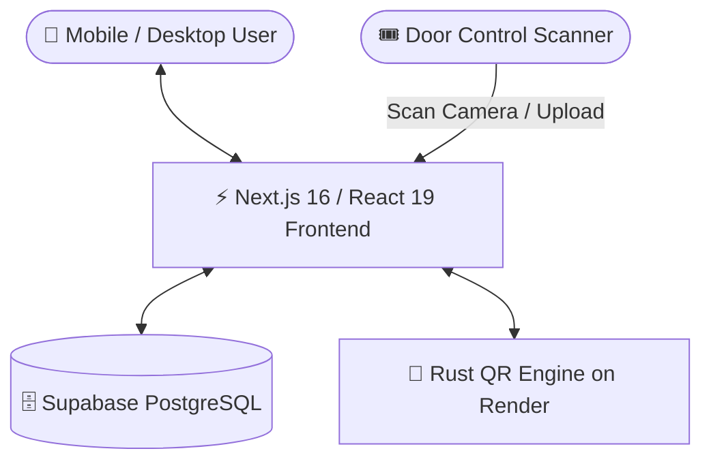

# 🎟️ EventPass — High-Concurreny Event Check-In & QR Management System


**EventPass** is an end-to-end event registration, dynamic QR ticket pass generation, and real-time door control check-in system designed for high concurrency, security, and responsive mobile access.

---

## 🌟 Key Features

### 1. 🎫 Dynamic & High-Security QR Passes
- **Dynamic 30s Cryptographic Token**: Prevents ticket sharing and screenshot fraud using time-step SHA-256 token hashing.
- **High-Res Ticket Download**: One-click download of physical-style attendee ticket passes with registration numbers (e.g. `25MIS1157`).
- **Event Isolation**: Unique registration passes for each event — checking in to Event A will never validate at Event B.

### 2. 📷 Dual Door-Control Scanner
- **Live Camera Scanner**: Rapid barcode scanning via device camera with instant feedback.
- **Image Upload Mode**: Upload ticket pass screenshots/downloads with instant image decoding via `html5-qrcode`.
- **Auto-Event Detection**: Automatically detects and matches the attendee's registered event.
- **Duplicate Check-In Protection**: Instantly detects and warns if a badge has already been scanned, timestamping exact entry time.
- **Offline Sync Queue**: Automatically queues check-ins locally if internet drops and syncs when reconnected.

### 3. 👥 Participant & Organizer Workspaces
- **Participant Workspace**: Browse upcoming published events, register in one click, view live passes, and unregister if needed.
- **Organizer Dashboard**: Real-time attendee counter, check-in percentage, upcoming events summary, and live participant table.
- **Event Management**: Create new events with capacity limits, event numbers, dates, times, and types.

### 4. ⚡ High-Performance Rust Microservice
- Powered by **Axum** & **Tokio** hosted on **Render** for sub-millisecond QR code rendering and TOTP token validation.

---

## 🏗️ System Architecture



- **Frontend**: Next.js 16 (Turbopack, React 19, Vanilla CSS Design System)
- **Database & Auth**: Supabase PostgreSQL with Row Level Security (RLS) and Realtime
- **QR Microservice**: Rust Axum API deployed on Render (`https://rust-qr-api.onrender.com`)

---

## 🚀 Quick Start (Local Setup)

### 1. Clone the repository
```bash
git clone https://github.com/roopakv-glithub/EventPass.git
cd EventPass
```

### 2. Install dependencies
```bash
npm install
# or
pnpm install
```

### 3. Configure Environment Variables
Copy `.env.example` to `.env.local`:
```bash
cp .env.example .env.local
```
Fill in your Supabase and Render API credentials:
```env
NEXT_PUBLIC_SUPABASE_URL=https://your-project.supabase.co
NEXT_PUBLIC_SUPABASE_ANON_KEY=your-anon-key
SUPABASE_SERVICE_ROLE_KEY=your-service-role-key
NEXT_PUBLIC_RUST_QR_API_URL=https://rust-qr-api.onrender.com
```

### 4. Run database migrations
Execute the SQL files inside `supabase/migrations/` in your **Supabase SQL Editor**:
1. `001_eventpass_schema.sql`
2. `002_fix_security_checkin_realtime.sql`
3. `005_make_organizer_id_optional.sql`
4. `006_add_regno_to_profiles.sql`
5. `007_concurrency_and_qr_tokens.sql`
6. `008_fix_permissions.sql`

### 5. Start the development server
```bash
npm run dev
```
Open [http://localhost:3000](http://localhost:3000) in your browser.

---

## 🌐 Production Deployment

### 1. Deploy Frontend to Vercel
1. Import this repository into [Vercel](https://vercel.com).
2. Add the environment variables:
   - `NEXT_PUBLIC_SUPABASE_URL`
   - `NEXT_PUBLIC_SUPABASE_ANON_KEY`
   - `SUPABASE_SERVICE_ROLE_KEY`
   - `NEXT_PUBLIC_RUST_QR_API_URL`
3. Click **Deploy**.

### 2. Deploy Rust Microservice to Render
1. Connect the `rust-qr-api` repository (`https://github.com/roopakv-glithub/Rustapi`) to [Render](https://render.com).
2. Runtime: **Docker**.
3. Set environment variable: `PORT = 8080`.
4. Setup a free keep-alive cron job at [cron-job.org](https://cron-job.org) hitting `https://YOUR-APP.onrender.com/health` every 10 minutes.

---

## 🧪 Testing Check-In Flows

1. Switch to **Participant** mode → click **"Register Event"**.
2. Go to **"My events"** → click **"Download ⬇"** to save your QR pass.
3. Switch to **Organizer** mode → open **Scanner**.
4. Upload or scan the ticket image.
5. Verification returns: **`✅ Check-in Successful: [Attendee Name]`**.
6. Scan again to verify duplicate detection: **`Already Checked In`**.

---
